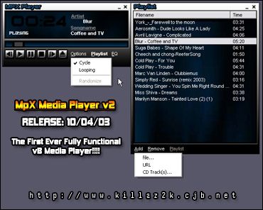



## MPX v2

### Description

Need your opinion on an media playerapplication i am working on...
 
### More Info
 

             |
---                |---
**Submitted On**   |
**By**             |[Aimee Bailey](https://github.com/Planet-Source-Code/PSCIndex/blob/master/ByAuthor/aimee-bailey.md)
**Level**          |Advanced
**User Rating**    |5.0 (10 globes from 2 users)
**Compatibility**  |VB 6\.0
**Category**       |[Sound/MP3](https://github.com/Planet-Source-Code/PSCIndex/blob/master/ByCategory/sound-mp3__1-45.md)
**World**          |[Visual Basic](https://github.com/Planet-Source-Code/PSCIndex/blob/master/ByWorld/visual-basic.md)
**Archive File**   |

### Source Code

basically i need to know what you think of the app in the screenshot, is it too simple? dose it need more pizazz? please tell me what you think, i would deeply appritiate it :P

